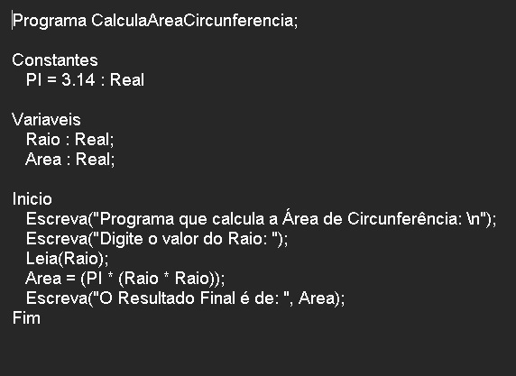

# CalculadoraAreaCircunferencia

**Calculadora Área de Circunferência em LPP | Português Estruturado | Portugol | Potigol | Metalinguagem | Pseudocódigo**  

## Enunciado

**Elaborar um programa de computador que calcule a área de uma circunferência e apresente a medida da área calculada.**  

calculadoraareacircunferencia

   

Autor: Erick Leite Freire 
Criado em: 15-10-2023 
Site: [Escola do Autodidata](https://www.escoladoautodidata.com.br) 
